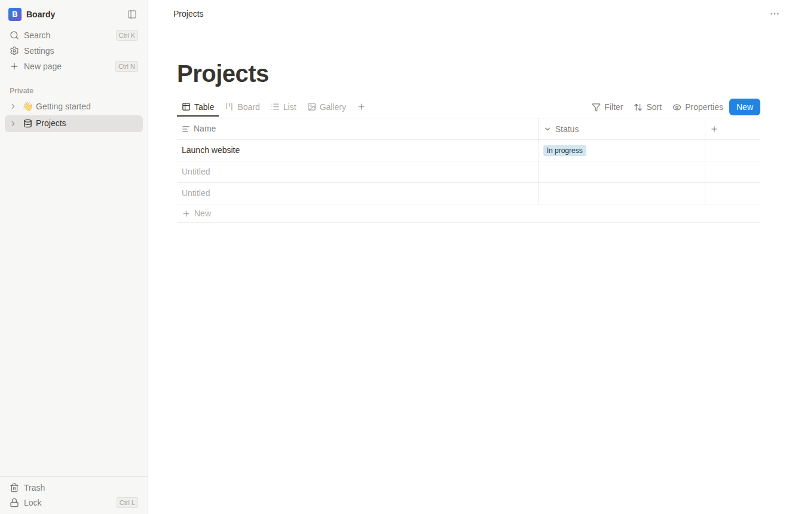

# Boardy

A local, encrypted block-based workspace for Linux. Pages with a block
editor (slash menu, markdown shortcuts), databases with **Table / Board / List /
Gallery** views, full-text search, light & dark themes — all stored on your machine,
encrypted with your master password. Nothing ever leaves your computer.



## Features

- **Block editor** (BlockNote/ProseMirror): headings, lists, to-dos, toggles, quotes,
  code blocks, tables, images — type `/` for the block menu, or use markdown
  shortcuts (`# `, `- `, `[] `, `> `, ```` ``` ````…). Markdown import/export per page.
- **Databases**: typed properties (text, number, select, multi-select, date, checkbox,
  URL), four views with per-view filters, sorting and property visibility. Kanban
  board with drag & drop grouped by any select property. Every row is also a page.
- **Sidebar** with infinitely nestable pages, drag to reorder/nest, duplicate, trash
  with restore.
- **Search**: `Ctrl+K` quick switcher over titles and page content (SQLite FTS5).
- **Security**: the SQLite database is fully encrypted (SQLite3 Multiple Ciphers,
  ChaCha20). The 256-bit database key is wrapped with AES-256-GCM under two secrets:
  your master password (scrypt-derived) and a one-time recovery key shown at setup.
  Forgot password → recovery key lets you set a new one. Optional idle auto-lock,
  `Ctrl+L` to lock instantly.

## Keyboard shortcuts

| Shortcut | Action |
| --- | --- |
| `Ctrl+K` | Search / quick switcher |
| `Ctrl+N` | New page |
| `Ctrl+L` | Lock workspace |
| `Ctrl+\` | Toggle sidebar |
| `/` in editor | Block menu |

## Running the AppImage

```sh
chmod +x Boardy-1.0.0.AppImage
./Boardy-1.0.0.AppImage
```

AppImages require FUSE 2. If you see *"dlopen(): error loading libfuse.so.2"*
(common on Ubuntu 22.04+):

```sh
sudo apt install libfuse2t64   # Ubuntu 24.04+ (use libfuse2 on older releases)
```

or run without FUSE: `./Boardy-1.0.0.AppImage --appimage-extract-and-run`

On Wayland sessions the app runs through XWayland for stability; set
`BOARDY_WAYLAND=1` to opt into native Wayland.

## Data & security model

- Data dir: `~/.config/boardy/` — `boardy.db` (encrypted SQLite) + `keystore.json`
  (wrapped keys, salts; contains no secrets in usable form) + `config.json`
  (theme/auto-lock preferences only).
- The master encryption key is generated randomly at setup; password changes and
  recovery only re-wrap it, so they are instant and never rewrite the database.
- **If you lose both the master password and the recovery key, the data is
  unrecoverable by design.**

## Development

```sh
npm install        # also rebuilds the native SQLite module for Electron
npm run dev        # hot-reloading dev app
npm run typecheck  # typecheck main + renderer
npm run dist       # build dist/Boardy-<version>.AppImage
node e2e.mjs       # CDP end-to-end suite (app must run with --remote-debugging-port=9223)
```

Stack: Electron 41 · electron-vite · React 19 · BlockNote · better-sqlite3-multiple-ciphers ·
dnd-kit · zustand. Main-process code in `src/main` (crypto, DB, IPC), UI in
`src/renderer`, shared types in `src/shared`.
